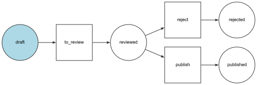
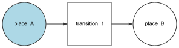
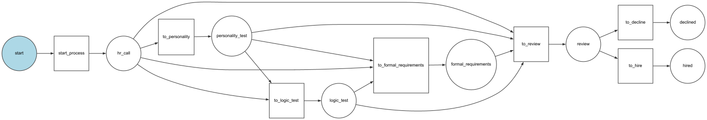
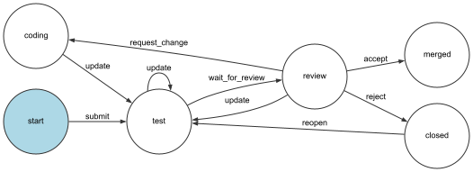
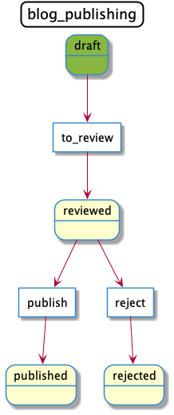
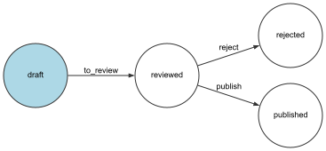
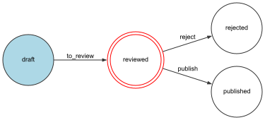
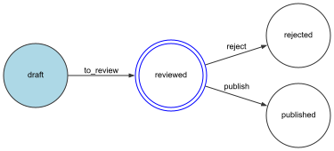

[](https://travis-ci.com/isfett/java-workflow)
[](https://codecov.io/gh/isfett/java-workflow)

- [Workflows and StateMachines](#workflows-and-statemachines)
- [Introduction](#introduction)
- [Installation](#installation)
    * [Operating System](#operating-system)
    * [Gradle](#gradle)
    * [Maven](#maven)
- [Creating a Workflow](#creating-a-workflow)
- [Creating multiple workflows](#creating-multiple-workflows)
    * [Usage](#usage)
- [Workflows and StateMachines](#workflows-and-statemachines-1)
    * [Workflows](#workflows)
        + [Examples](#examples)
    * [State Machines](#state-machines)
        + [Example](#example)
- [Visualize Workflows](#visualize-workflows)
- [Events](#events)
    * [Guard Events](#guard-events)
    * [Choosing which Events to Dispatch](#choosing-which-events-to-dispatch)
    * [Event Methods](#event-methods)
    * [Default EventDispatcher](#default-eventdispatcher)

# Workflows and StateMachines

This library is an open-source, workflow and statemachine engine.

# Introduction

It gives you an object-oriented way to define a process or a life cycle that your object goes
through.
Each step in the process is called a place. You can also define transitions that describe the
actions to get from one place to another.

# Installation

## Operating System

In order to dump the workflows to images (like in the docs) you need `graphviz` installed and
the `dot` executable in your path (see [Graphviz Documentation](https://graphviz.org/download/)).

## Gradle

```
dependencies {
    implementation('com.isfett:workflow:<version>')
}
```

## Maven

```
<dependency>
    <groupId>com.isfett</groupId>
    <artifactId>workflow</artifactId>
    <version>[version]</version>
</dependency>
```

# Creating a Workflow

A set of places, transitions and initial places (optional) creates a definition. A workflow or
statemachine needs a `Definition` and a way to write the states to the objects (i.e. an instance
of `MarkingStoreInterface`).

Consider the following workflow example for a blog post. A post can have just one (`String`
or `Enum`) of a number of predefined places (`draft`, `reviewed`, `rejected`, `published`).

```java
DefinitionBuilder definitionBuilder = new DefinitionBuilder();
Definition definition = definitionBuilder
    .addPlace("draft")
    .addPlace("reviewed")
    .addPlace("rejected")
    .addPlace("published")
    .addTransition(new Transition("to_review", List.of("draft"), List.of("reviewed")))
    .addTransition(new Transition("publish", List.of("reviewed"), List.of("published")))
    .addTransition(new Transition("reject", List.of("reviewed"), List.of("rejected")))
    .build();

Boolean singleState = true; // true if the subject can be in only one state at a given time
MarkingStoreInterface markingStore = new MethodMarkingStore(singleState, "status"); // markingStore will call String getStatus() and void setStatus(String status) in this example
WorkflowInterface workflow = new Workflow(definition, markingStore);
```



The `Workflow` can now help you to decide what transitions are allowed on a post depending on what
place it is in actually. This will keep your domain logic in one place and not spread it all over 
your application.

# Creating multiple workflows

When you define multiple workflows you should consider using a `WorkflowRegistry`, which is an
object that stores and provides access to different workflows. A registry will also help you to
decide if a workflow supports the object you are trying to use it with

```java
WorkflowRegistry workflowRegistry = new WorkflowRegistry();
workflowRegistry.addWorkflow(blogWorkflow, new InstanceOfSupportStrategy(Post.class));
workflowRegistry.addWorkflow(newsletterWorkflow, new InstanceOfSupportStrategy(Newsletter.class));
```

## Usage

When you have configured a `WorkflowRegistry` with all of your workflows, you can retrieve a
workflow from it and use it:

```java
Post post = new Post();
post.getStatus(); // draft
WorkflowInterface workflow = workflowRegistry.get(post); // throws Exceptions when no workflow was found, or when more then one was found (you then can use workflowRegistry.get(post, "name_of_your_workflow");)

workflow.can(post, "publish"); // false
workflow.can(post, "to_review"); // true

workflow.apply(post, "to_review");
post.getStatus(); // reviewed

workflow.can(post, "publish"); // true
workflow.getEnabledTransitions(post); // List<String> ["publish", "reject"]
```

# Workflows and StateMachines

## Workflows

A definition of a workflow consists of places and actions to get from one place to another. The 
actions are called transitions. A workflow also needs to know each object's position in the 
workflow. The marking store writes the current place to a property on the object.

The terminology above is commonly used when discussing workflows and 
[Petri nets](https://en.wikipedia.org/wiki/Petri_net).

### Examples
The simplest workflow looks like this. It contains two places and one transition.



Workflows could be much more complicated when they describe a real business case. This workflow 
describes the process to fill in a job application.



When you fill in a job application there are 4 to 7 steps depending on the job and department you
are applying for. Some jobs or departments require personality tests, logic tests and/or formal
requirements to be answered by the applicant. Some jobs don't. The `GuardEvent` is used to decide
what next steps are allowed for a specific application.

By defining a workflow like this, there is an overview how the process looks like. The logic is 
not mixed with the controllers, models or view. The order of the steps can be changed by changing
the definition only.

## State Machines
A state machine is a subset of a workflow and its purpose to hold a state of your model. The
most important differences between them are:
- Workflows can be in more than one place at the same time; whereas state machines can't;
- In order to apply a transition, workflows require that the object is in all the previous places
of the transition, whereas state machines only require that the object is at least in on of those
places.

### Example
A pull request starts in an initial `start` state, then a state `test` for e.g. running tests on 
continuous integration stack. When this is finished, the pull request is in the `review` state, 
where contributors can require changes, reject or accept the pull request. At any time, you can 
also `update` the pull request, which will result in another continuous integration run.



# Visualize Workflows
To help you debug your workflows, you can generate a visual representation of them as PNG image. 
Make sure you have `graphviz` (see [Installation - Operating System](#operating-system)) installed.

You can generate images for Graphviz with `GraphvizDumper` or for PlantUML with `PlantUmlDumper`.

Let's take our very first workflow:

```java
DefinitionBuilder definitionBuilder = new DefinitionBuilder();
Definition definition = definitionBuilder
    .addPlaces(List.of("draft", "reviewed", "rejected", "published"))
    .addTransition(new Transition("to_review", List.of("draft"), List.of("reviewed")))
    .addTransition(new Transition("publish", List.of("reviewed"), List.of("published")))
    .addTransition(new Transition("reject", List.of("reviewed"), List.of("rejected")))
    .build();
```

We now can generate an image with the `GraphvizDumper`
```java
DumperInterface dumper = new GraphvizDumper();
dumper.generateImage(new File("/path/to/image.png"), DumperInterface.modes.WITH_TRANSITION_BOX, definition, null, Map.of());
```


Or generate an image with the `PlantUmlDumper`
```java
DumperInterface dumper = new PlantUmlDumper();
dumper.generateImage(new File("/path/to/image.png"), DumperInterface.modes.WITH_TRANSITION_BOX, definition, null, Map.of("default", Map.of("title", "blog_publishing")));
```


You can remove the transition boxes with the second parameter if you want to
```java
DumperInterface dumper = new GraphvizDumper();
dumper.generateImage(new File("/path/to/image.png"), DumperInterface.modes.WITHOUT_TRANSITION_BOX, definition, marking, Map.of());
```


You can also add a marking as fourth parameter to show where the current object is actually in the
workflow (here `Post post`)
```java
DumperInterface dumper = new GraphvizDumper();
MarkingStoreInterface markingStore = new MethodMarkingStore(true, "status");
WorkflowInterface workflow = new Workflow(definition, markingStore);
Post post = new Post();
post.setStatus("reviewed");
Marking marking = workflow.getMarking(post); // will call Post::getStatus()
dumper.generateImage(new File("/path/to/image.png"), DumperInterface.modes.WITH_TRANSITION_BOX, definition, marking, Map.of());
```


Last thing to customize adding a `Map<String, Map<String, String>>` as last parameter to change
the default settings of the generated image. Check the dumper classes for defaults
```java
DumperInterface dumper = new GraphvizDumper();
dumper.generateImage(new File("/path/to/image.png"), DumperInterface.modes.WITHOUT_TRANSITION_BOX, definition, marking, Map.of("default", Map.of("markedColor", "#0000FF")));
```


# Events
To make your workflows more flexible, you can construct the `Workflow` with an Instance implementing
`EventDispatcherInterface` (or using the built in `EventDispatcher`). You can now create event 
listeners to do additional actions when a workflow operation happened (e.g. sending announcements)
or to block transitions (i.e. depending on the data of the object in the workflow).

Each step has three events that are fired in order:
- An event for every workflow
- An event for the workflow concerned
- An event for the workflow concerned with the specific transition or place name

When a state transition is initiated, the events are dispatched in the following order:

`workflow.guard`
Validate whether the transition is blocked or not (see [Events - Guard Events](#guard-events)).

The three events being dispatched are:
- `workflow.guard`
- `workflow.[workflow name].guard`
- `workflow.[workflow name].guard.[transition name]`


`workflow.leave`
The subject is about to leave a place.

The three events being dispatched are:
- `workflow.leave`
- `workflow.[workflow name].leave`
- `workflow.[workflow name].leave.[place name]`


`workflow.transition`
The subject is going through this transition.

The three events being dispatched are:
- `workflow.transition`
- `workflow.[workflow name].transition`
- `workflow.[workflow name].transition.[transition name]`


`workflow.enter`
The subject is about to enter a new place. The event is triggered before the subject places are
updated, which means that the marking of the subject is not yet updated with the new places.

The three events being dispatched are:
- `workflow.enter`
- `workflow.[workflow name].enter`
- `workflow.[workflow name].enter.[place name]`


`workflow.entered`
The subject has entered the places and the marking is updated.

The three events being dispatched are:
- `workflow.entered`
- `workflow.[workflow name].entered`
- `workflow.[workflow name].entered.[place name]`


`workflow.completed`
The subject has completed the transition.

The three events being dispatched are:
- `workflow.completed`
- `workflow.[workflow name].completed`
- `workflow.[workflow name].completed.[transition name]`


`workflow.announce`
Triggered for each transition that now is accessible for the subject.

The three events being dispatched are:
- `workflow.announce`
- `workflow.[workflow name].announce`
- `workflow.[workflow name].announce.[transition name]`

After a transition is applied, the announce event tests for all available transitions. That will
trigger all guard events once more which could impact performance on big workflows.

Here is an example of how to log every leave event on a specific workflow:
```java
public class Post{
    private Integer id;
    private String status = "draft";
    private String title = "";

    public Post() {}

    public Post(String status) {
        this.status = status;
    }

    public Integer getId() {
        return id;
    }

    public void setId(Integer id) {
        this.id = id;
    }

    public String getStatus() {
        return status;
    }

    public void setStatus(String status) {
        this.status = status;
    }

    public String getTitle() {
        return title;
    }

    public void setTitle(String title) {
        this.title = title;
    }
}

public class LogPostLeaveEventListener implements EventListenerInterface {
    private static final Logger log = LoggerFactory.getLogger(LogPostLeaveEventListener.class);

    public void onLeave(LeaveEvent event, String eventName) {
        Post post = (Post) event.getSource();
        log.info(String.format(
            "Blog post (id: %s) performed transition %s from %s to %s",
            post.getId(),
            event.getTransition().getName(),
            String.join(", ", event.getMarking().getPlaces()),
            String.join(", ", event.getTransition().getTos())
        ));
    }
}

....

WorkflowInterface postWorkflow = new Workflow(definition, markingStore, "blog_publishing", new EventDispatcher());
postWorkflow.addEventListener(new LogPostLeaveEventListener(), List.of("workflow.blog_publishing.leave")); // we are only interesting for all leave events for this specific workflow
Post post = new Post();
post.setId(1337);
post.setStatus("draft");
postWorkflow.apply(post, "to_review");
```
This would give us a log message containing:
```
Blog post (id: 1337) performed transition to_review from draft to reviewed
```

## Guard Events
Guard Events are special types of events. Their event listeners are invoked every time a call to 
`Workflow::can()`, `Workflow::apply()` or `Workflow::getEnabledTransitions()` is executed. You can
add custom logic to decide which transitions should be blocked or not.

This example stops any blog post being transitioned to `reviewed` if it is missing a title:
```java
public class BlogPostReviewGuardEventListener implements EventListenerInterface {
    public void onGuard(GuardEvent event, String eventName) {
        Post post = (Post) event.getSource();

        if(post.getTitle().isEmpty()) {
            event.setBlocked(true, "This post cannot be marked as reviewed because it has no title.");
        }
    }
}

...

WorkflowInterface postWorkflow = new Workflow(definition, markingStore, "blog_publishing", new EventDispatcher());
postWorkflow.addEventListener(new LogPostLeaveEventListener(), List.of("workflow.blog_publishing.leave"));
postWorkflow.addEventListener(new BlogPostReviewGuardEventListener(), List.of("workflow.blog_publishing.guard.to_review"));
post = new Post();
post.setId(1337);
post.setStatus("draft");
System.out.println(postWorkflow.can(post, "to_review")); // false
System.out.println(postWorkflow.buildTransitionBlockerList(post, "to_review").stream().map(TransitionBlocker::getMessage).toList()); // List<String> [This post cannot be marked as reviewed because it has no title.]
postWorkflow.apply(post, "to_review"); // throws TransitionNotEnabledException -> Transition to_review is not enabled for workflow blog_publishing
```

## Choosing which Events to Dispatch
If you prefer to control which events are fired when performing each transition, use the last
parameter of the `Workflow` constructor. This option does not apply to Guard events, which are 
always fired if a `EventDispatcherInterface` instance is present.

This would just dispatch guard, enter and leave events. Transition, entered, completed and announce
events are dropped.
```java
WorkflowInterface postWorkflow = new Workflow(definition, markingStore, "blog_publishing", new EventDispatcher(), List.of(Workflow.events.ENTER, Workflow.events.LEAVE));
```

## Event Methods
Each workflow event is an instance of a class extending from `AbstractWorkflowEvent`. This means 
that each event can access the following information:
- Marking getMarking() - returns the `Marking` of the workflow (current state of the object)
- Object getSubject() - returns the object that dispatches the event
- Transition getTransition() - returns the `Transition` that dispatches the event
- WorkflowInterface getWorkflow() - return the `WorkflowInterface` that triggered the event

For Guard Events, there is an extended `GuardEvent` class. This class has these additional methods:
- Boolean isBlocked() - returns true if transition is blocked
- void setBlocked(Boolean blocked) - sets the blocked value without message
- void setBlocked(Boolean blocked, String message) - sets the blocked value with message
- List<TransitionBlocker> getTransitionBlockerList() - returns the blockers for the event created by
setBlocked(true) or en empty List when setBlocked(false)

## Default EventDispatcher
The default `EventDispatcher` class bundled within this repository will hold up all added
`EventListenerInterface` instances. Depending on the type of the event the EventDispatcher will call
different methods within the EventListener instances.

- AnnounceEvent -> onAccount(AnnounceEvent event, String eventName)
- CompletedEvent -> onCompleted(CompletedEvent event, String eventName)
- EnteredEvent -> onEntered(EnteredEvent event, String eventName)
- EnterEvent -> onEnter(EnterEvent event, String eventName)
- GuardEvent -> onGuard(GuardEvent event, String eventName)
- LeaveEvent -> onLeave(LeaveEvent event, String eventName)
- TransitionEvent -> onTransition(TransitionEVent event, String eventName)

The EventDispatcher checks the existence and accessibility of the methods before firing the events
and throws an `EventCanNotBeDispatchedException` when the desired method is not found, not public or
has the wrong (or wrong count of) parameters.

If the default EventDispatcher does not suit you, feel free to write an own EventDispatcher 
implementing`EventDispatcherInterface` and add the instances to the Workflow or StateMachine 
constructors.